# Icy Magic

Clemen Deng (PennKey: clemen)

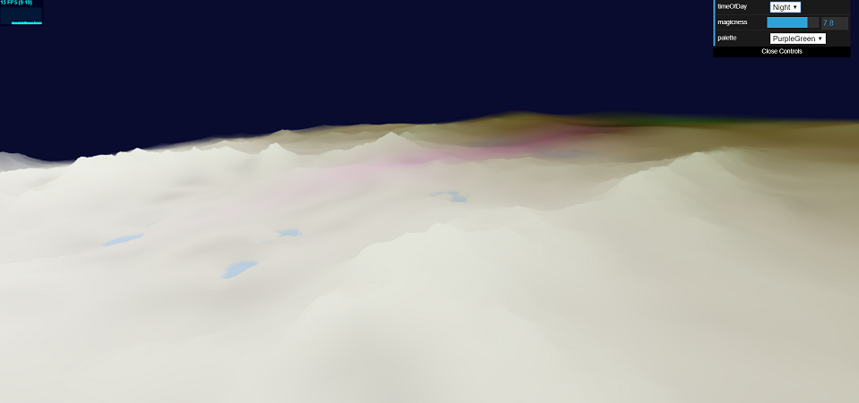

This project is created using procedural noise functions. Viewing this project
requires a WebGL capable browser.

[WebGL link](https://clemendeng.github.io/hw01-noisy-terrainn/)

## Resources
Inigo Quilez's info on [palettes](https://iquilezles.org/www/articles/palettes/palettes.htm)

Wikipedia page on [Perlin noise](https://en.wikipedia.org/wiki/Perlin_noise)

## Features
This program features the following:

__Worley noise__

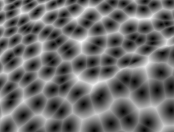

__Perlin noise__

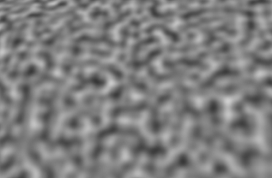

__Fractal Brownian Motion (Worley shown)__

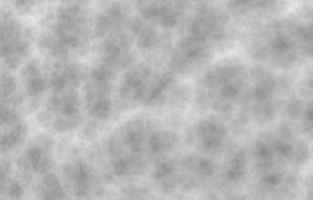

__Two noise-based environments__: an icy mountainous region and a cold grass and
dirt region. The mountainous region is based on fractal brownian motion with
Worley noise as a basis, and the grass region is based on Perlin noise.

Mountainous (fbm worley):

Dirt/Grass (perlin):

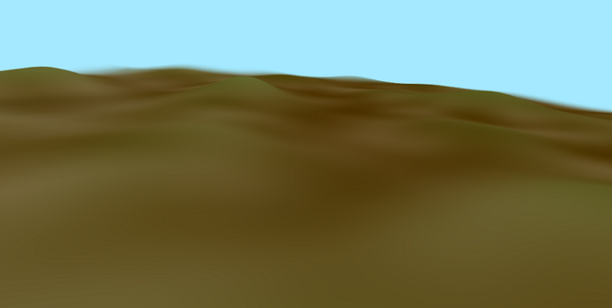

__Temperature__: varies from cold to colder. Cold regions are grassy,
colder regions are mountainous, and these are interpolated in between.

Interpolation:

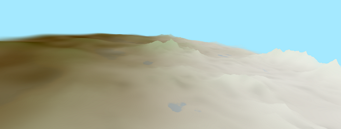

__Remapping height fields__ to create more mountainous regions as well as ponds
in the colder region

Pond:

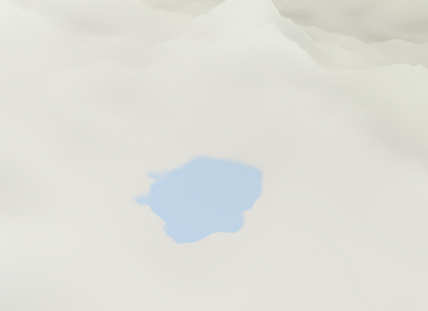

Underside of pond:

__Mysticality__: This attribute is based on a Worley noise field. 
The edges of worley noise are more mystic. This appears as color spectrums:

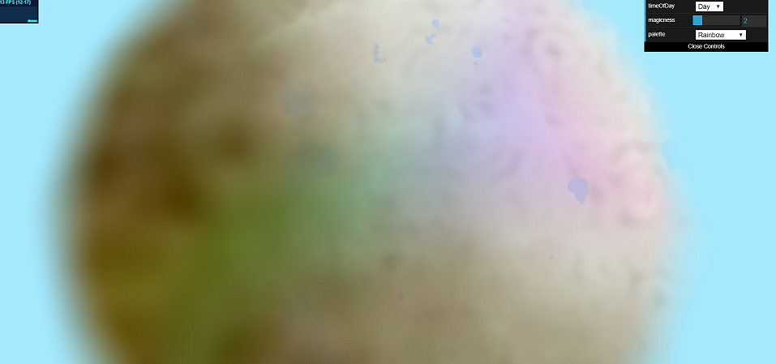

__Incorporation of time__: time is used to displace the mystic Worley field,
as well as vary the colors on the spectrum.

## Controls
The user can also control parameters to change the scene:

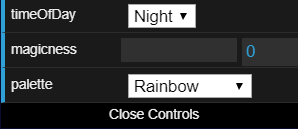

__Day/Night__: The user can modify the color of the background to make it appear
as if it is day or night

Night:

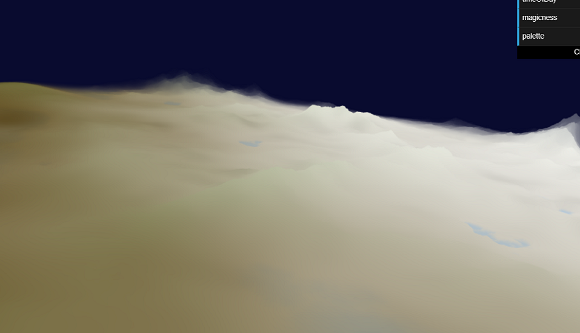

__Magicness__: This variable changes how apparent the mystical Worley lines are

Magicness = 8 (max: 10):

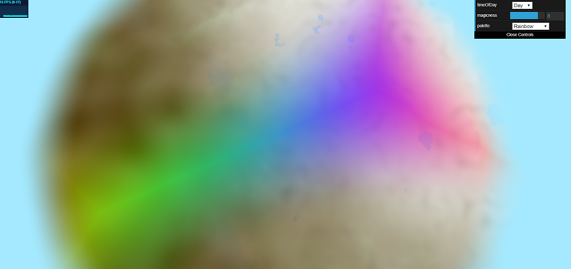

__Palette__: This allows the user to change the color spectrum. Available options are
rainbow, purple-green, and blue-orange.

Purple-Green:

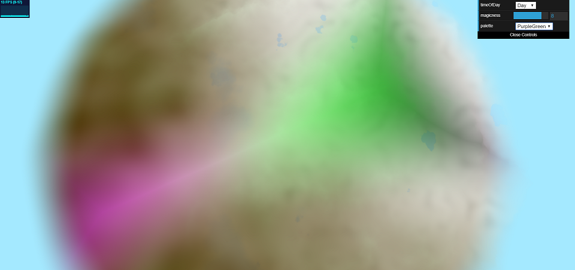

Blue-Orange:

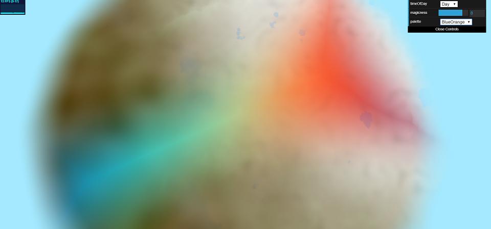